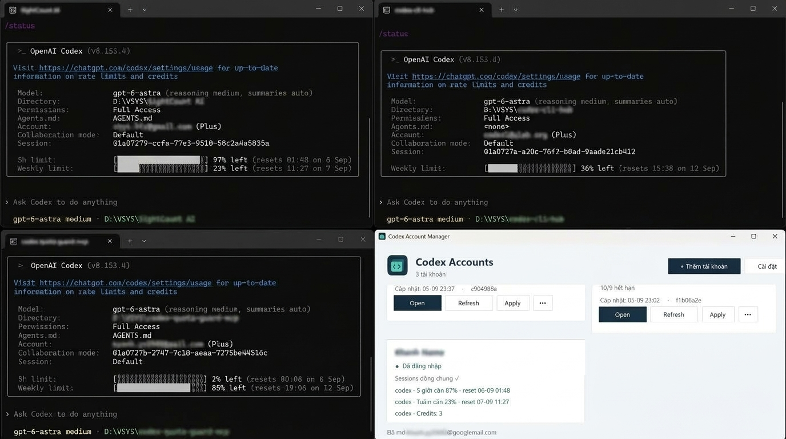

# Codex Account Manager

Ứng dụng Windows desktop portable quản lý nhiều profile Codex CLI. C#/.NET 8,
WinForms, giao diện thẻ với cửa sổ thêm tài khoản/cài đặt riêng; không installer/service.

Từ v1.4.0, giao diện app sử dụng **English**. Tên/note tài khoản do người dùng nhập giữ nguyên.

V1.7: thẻ gọn hơn với thông tin ngắn chia cột cùng hàng; giữ đủ quota và thao tác,
ghi chú dài có tooltip và vẫn chỉnh sửa trong Details. Các thẻ giữ chiều cao bằng nhau.

V1.5: thẻ chỉ có quota tuần mang nền vàng; quota 5h hoặc tuần còn ≤10% chuyển xám
(thẻ vàng chuyển vàng nhạt). Các thẻ có cùng chiều cao; loại gói hiện cạnh trạng thái đăng nhập
nếu Codex trả về. **Open CLI** và **Resume in CLI** mở phiên CLI.
Khi app đang mở, mỗi mốc reset quota đã biết kích hoạt Refresh một lần sau **60 giây**; lần thử được lưu
để không lặp sau lỗi/khởi động lại. Khi mở lại app sau giờ reset, mốc chưa thử sẽ được xử lý.
Refresh thất bại có thể thử lại bằng nút **Refresh**. App không tự mở khi đang tắt.

V1.6: Refresh tự động chạy nền từng tài khoản; chờ 2 giây sau khởi động và giữa các lượt.
Giao diện vẫn thao tác được, chỉ thẻ đang Refresh tạm khóa. Đóng app sẽ hủy lượt nền đang chạy.
Menu **••• → Use reset credit…** dùng một lượt reset có sẵn sau khi xác nhận tên tài khoản.
App không mua lượt reset. Nếu kết quả chưa xác định do lỗi mạng, **Retry reset attempt…** dùng lại
mã lần thử đã lưu để không dùng thêm lượt. Hoàn tất lần thử trước khi đăng nhập lại tài khoản đó.
Refresh tự động không bao giờ dùng lượt reset. Chức năng này dùng
[giao thức chính thức](https://learn.chatgpt.com/docs/app-server) `account/rateLimitResetCredit/consume`.

[Tải bản mới nhất](https://github.com/valentine-89/codex-cli-hub/releases/latest) ·
[Changelog](CHANGELOG.md) · [Đóng góp](CONTRIBUTING.md) · [Bảo mật](SECURITY.md) · [MIT](LICENSE)

Dự án độc lập, không phải sản phẩm chính thức của OpenAI.



Quản lý tài khoản, theo dõi quota và mở nhiều phiên Codex CLI từ một giao diện gọn nhẹ.

## Chạy bản portable

Tải ZIP ở trang Releases, giải nén vào thư mục riêng có quyền ghi và chạy `CodexAccountManager.exe`.
ZIP chỉ chứa EXE; app tự tạo dữ liệu khi sử dụng. Sau khi đã thêm tài khoản, copy **cả thư mục**
để chuyển vị trí. Bản build local nằm tại `dist/CodexAccountManager/CodexAccountManager.exe`.
Bản **Windows x64 nhẹ, single-file, framework-dependent** không nhúng .NET runtime.
Máy cần **.NET 8 Desktop Runtime x64**, Codex CLI chính thức và PowerShell.
Ưu tiên PowerShell 7; nếu không có, app dùng Windows PowerShell 5.1. Mọi terminal/check đều
dùng `-NoProfile -EncodedCommand` và thiết lập UTF-8 cho `$OutputEncoding`, console input/output.
Nếu thiếu .NET, executable dùng hộp thoại tải runtime của .NET apphost; chọn tải để mở trang Microsoft
và tự cài đặt. App không tự cài phần mềm hoặc tạo yêu cầu UAC. Trong Cài đặt cũng có link tải
[.NET 8 Desktop Runtime](https://dotnet.microsoft.com/en-us/download/dotnet/8.0).
Đặt app trên ổ NTFS local có quyền ghi, không đặt dưới Program Files,
thư mục junction/symlink, network share hoặc thư mục shared sessions.

1. Bấm **Add account**; nhập tên và ghi chú tùy chọn.
2. Chọn **New login** hoặc **Copy default Codex account**.
3. Đăng nhập mới mở terminal `codex login`; terminal tự đóng khi thành công, giữ lại khi lỗi. Chế độ sao chép lấy riêng `auth.json` từ Codex Home gốc,
   không mở login và không sửa file nguồn. Thiếu auth.json (ví dụ credential chỉ nằm trong keyring)
   thì báo lỗi; không tự chọn phương thức khác.
4. Cả hai cách đều sao chép `config.toml` gốc nếu có, sau đó ghi root setting
   `cli_auth_credentials_store = "file"`. Các cài đặt khác và comment giữ nguyên.
   File nguồn không tồn tại thì tạo config tối thiểu cho profile mới.
5. Mỗi thẻ có **Open**, **Refresh**, **Apply**; menu **•••** chứa Log in again, Resume, Open folder, Details và Delete account.
   Chọn **Details** để sửa tên/ghi chú và bấm **Save**; thẻ cập nhật ngay, giữ nguyên phiên login.
6. **Settings** mở cửa sổ nâng cao: Codex Home gốc, thư mục làm việc, đường dẫn CLI/PowerShell và link .NET.

**Open** luôn hiện cửa sổ chọn dự án trước khi mở terminal. Danh sách trích `payload.cwd` trong
record `session_meta` của các file `.jsonl` dưới sessions gốc, gộp trùng (không phân biệt hoa thường),
xếp tên repo A–Z, đường dẫn làm thứ tự phụ khi trùng tên; thư mục đã mất nằm cuối. Có ô tìm kiếm và **Browse…**.
Thư mục đã mất được đánh dấu và không thể Open. Hủy sẽ không mở terminal; chọn dự án không
thay đổi cài đặt chung. Catalog chỉ parse phần đầu metadata giới hạn 128 KiB mỗi file,
không duyệt qua junction con hoặc đọc nội dung hội thoại để suy đoán dự án.
Session lỗi/không có cwd/đường dẫn ngoài định dạng Windows local được bỏ qua và đếm trên dialog.

Có thể mở nhiều account đồng thời. Đóng manager không đóng/kill terminal.
Không có tự động polling. **Refresh trên thẻ** kiểm tra dependency, junction và login của chính
tài khoản đó. Tạo bằng cách sao chép cũng kiểm tra login local một lần nếu CLI có sẵn.
CLI/Powershell không tìm thấy được báo trong status bar, không làm app crash.

## Dữ liệu và credential

```text
CodexAccountManager/
  CodexAccountManager.exe
  accounts.json
  settings.json
  manager.lock
  logs/app.log
  profiles/<GUID>/
    config.toml
    auth.json          # CLI tạo sau login hoặc sao chép khi người dùng chọn
    ...private state...
    sessions -> <Default Codex Home>/sessions
```

App dùng thư mục executable, không phụ thuộc current working directory. Không lưu password,
không hiển thị/giải mã auth.json. Chỉ sao chép file này khi người dùng chọn trong form thêm tài khoản;
không sao chép database, lịch sử, token từ nguồn khác hoặc toàn bộ Codex Home.
`accounts.json` chỉ chứa metadata và trạng thái chuẩn hóa.
Mỗi profile được ghi `cli_auth_credentials_store = "file"` ngay trong TOML khi tạo, khi mở app,
và trước Open/Refresh. Giá trị keyring/auto trong root config được đổi sang file; các phần khác giữ nguyên.
Tham số `-c cli_auth_credentials_store="file"` vẫn được truyền vào từng lệnh để bảo đảm nhất quán.
Không sửa TOML gốc. Các đoạn prompt nhiều dòng có nội dung giống tên setting không bị sửa.
Auth được sao chép là một snapshot độc lập về file, không phải tài khoản mới; hai bản vẫn dùng
cùng tài khoản dịch vụ, và có thể cần đăng nhập lại khi credential bị thu hồi hoặc thay đổi.
Environment credential/remote attachment đã biết được loại khỏi terminal con để tránh kế thừa
identity của process chạy manager. Không sửa biến môi trường Windows. Auth mặc định chỉ được thay
khi người dùng bấm **Apply** và xác nhận; config mặc định không bị sửa.
Các thay đổi thủ công về provider/config/environment trong terminal thuộc quyền kiểm soát người dùng.

JSON ghi nguyên tử bằng temporary file cạnh file đích rồi rename. Không tạo backup thường trực.
File lỗi hoặc version không hỗ trợ bị từ chối, không reset dữ liệu. Chỉ một manager cho mỗi
portable folder; khóa `manager.lock` tự nhả khi process thoát, file tồn tại không có nghĩa còn khóa.
Log tối đa khoảng 1 MiB, chỉ operation/path/mã lỗi; không log raw CLI output hoặc credential.
Codex CLI tự quản lý log/state của nó trong profile; các file đó cũng cần được giữ riêng tư.

## Shared sessions: phạm vi thực tế

Chỉ `profiles/<GUID>/sessions` là **NTFS Directory Junction** trỏ tới thư mục sessions có sẵn.
App không tự tạo/sửa thư mục Codex Home mặc định. Auth, config, history.jsonl, database/index
và các state khác vẫn riêng. Sharing session files **không đảm bảo** resume picker/index của App
và từng CLI giống nhau, đặc biệt khi CLI dùng định dạng hoặc cơ chế migration mới.
Resume `--all` bỏ lọc working directory nhưng không đồng bộ database riêng.

Junction là link đọc/ghi: lệnh Codex sửa/xóa session có thể tác động đến session được chia sẻ.
Cam kết bảo toàn bên dưới áp dụng cho chức năng **Delete account** của manager.
Không junction toàn bộ `.codex` và không tự mở rộng phần được chia sẻ để sửa vấn đề resume.

Junction dùng target tuyệt đối. Chuyển thư mục trên cùng máy giữ target; chuyển sang máy khác
cần target tương ứng. Không tự đổi target của profile có sẵn. Muốn thay Default Codex Home,
Delete các account an toàn trước rồi đổi settings. PowerShell 5.1 fallback đã được người dùng cho phép;
app không tự chuyển đổi schema JSON không được hỗ trợ.

## Trạng thái account và quota

Đã xác minh với Codex CLI **0.153.4**:
- `codex login`: luồng đăng nhập chính thức.
- `codex login status`: trạng thái credential local; **không chứng minh token còn hợp lệ online**.
- `codex resume --all`: mở picker không lọc thư mục.
- Không có standalone subcommand quota trong `codex --help` đã kiểm tra.

Refresh gọi **giao thức app-server chính thức `account/rateLimits/read`** bằng một process Codex riêng,
`CODEX_HOME` riêng và stdio. Process kết thúc sau khi đọc, không mở daemon/port, không tạo thread/turn,
không đọc token để gọi private endpoint, không tiêu thụ reset và không gửi email.
Native executable được tìm từ Codex .exe hoặc cấu trúc gói npm chính thức đã kiểm tra.

Mỗi thẻ hiển thị tất cả bucket/window có trong kết quả, phần trăm còn lại và giờ reset địa phương;
tên chu kỳ lấy từ `windowDurationMins`. Tài khoản chỉ có tuần sẽ **không có dòng 5 giờ giả**.
Credits, giới hạn chi tiêu và số lượt reset cũng được hiện khi server trả về.
Giá trị null là chưa có dữ liệu, không được biến thành 0. Lỗi/quá thời gian 30 giây giữ snapshot cũ
với nhãn dữ liệu cũ. Metadata quota được lưu trong accounts.json, không chứa credential hoặc raw response.
`login status` vẫn là kiểm tra credential local, không đồng nghĩa token hợp lệ online.

## Apply đăng nhập vào Codex chính

Bấm **Apply** trên thẻ rồi xác nhận trong dialog. Trước khi xác nhận, **đóng Codex App và các
terminal đang dùng phiên chính**; mở lại sau khi Apply xong. App không tự đóng/kill Codex.
Chỉ `auth.json` của profile được áp dụng vào Codex Home gốc đang cấu hình; config và sessions giữ nguyên.
File nguồn được sao chép vào temp cạnh file đích, kiểm tra JSON rồi thay file nguyên tử, không tạo backup.
Auth nguồn thiếu/lỗi hoặc file đích bị khóa sẽ dừng; không thay bằng một file dở dang.
Apply dành cho đăng nhập dùng `auth.json`; không chuyển đổi credential trong OS keyring.

## Xóa account và gỡ app

Đóng mọi terminal dùng profile. Chọn **••• → Delete account**, đọc tên và đường dẫn trong confirmation.
Manager chặn terminal đang theo dõi còn chạy; sau restart cần người dùng đảm bảo đóng cả
terminal cũ hoặc được mở thủ công. Manager không force-kill Codex.

Quy trình: validate ID/path/ancestors → preflight toàn profile, từ chối reparse bất thường →
verify mount-point tag và target sessions → tháo junction bằng delete không recursive →
verify shared directory còn tồn tại → xóa private tree bằng traversal không theo link →
xóa metadata cuối cùng. Directory handles ngăn rename/reparse khi đang traversal.
Không dùng `Directory.Delete(path, true)` hoặc recursive delete qua junction.

**Trước khi xóa cả thư mục portable, Delete từng account trong app.** Chỉ sau khi tháo hết
junction mới xóa thư mục app. Không giả định mọi công cụ recursive delete đều an toàn với junction.

## Recovery thủ công

Khi một preflight thất bại, manager không xóa file. Nếu hệ thống mất điện/file lock/xâm nhập
đồng thời xảy ra sau detach, private profile có thể bị xóa một phần và metadata vẫn còn.
Manager sẽ từ chối đoán tiếp nếu junction thiếu. Không bấm recursive delete để thử khắc phục.

1. Đóng manager và tất cả terminal dùng profile; xác nhận đúng portable folder và account ID.
2. Trong PowerShell 7, dùng `Get-Item -LiteralPath '<absolute profile>\sessions' -Force |
   Format-List FullName,LinkType,Target` để kiểm tra, không dùng wildcard.
3. Nếu sessions là thư mục thật/symlink/sai target: giữ nguyên dữ liệu, xác định nguyên nhân.
   Không chuyển/xóa tự động. Nếu link đã tháo sau một lần Delete thất bại và thư mục `sessions`
   hoàn toàn không còn, có thể tạo lại đúng junction bằng `New-Item -ItemType Junction -Path
   '<absolute profile>\sessions' -Target '<verified default home>\sessions'`, kiểm tra lại target,
   rồi dùng Delete trong app.
4. Nếu private profile đã mất nhưng record vẫn còn do lỗi ghi JSON: xác minh shared sessions
   còn nguyên, sau đó sửa **chỉ record đúng ID** trong accounts.json khi manager đã đóng.
5. Nếu Add thất bại trước khi lưu record, thư mục GUID có thể còn nhưng không hiện trong grid.
   Kiểm tra config và junction; thêm record đúng schema ở dưới để Delete trong app. Không xóa
   cả cây chưa kiểm tra. Nếu tạo junction đã thất bại và chỉ để lại sessions rỗng bình thường,
   chỉ xóa riêng thư mục rỗng đó (không recursive), tạo junction đã xác minh rồi đăng ký record.
6. JSON lỗi: sửa cú pháp/version/schema trong file hiện có. Không sửa nội dung auth.json.

```json
{
  "version": 1,
  "accounts": [{
    "id": "0123456789abcdef0123456789abcdef",
    "displayName": "Recovered account",
    "profilePath": "profiles/0123456789abcdef0123456789abcdef",
    "sharedSessions": true,
    "createdAt": "2026-09-05T00:00:00Z",
    "lastCheckedAt": null,
    "loginStatus": "Not checked",
    "note": ""
  }]
}
```

## Build, tests, publish

Cần .NET 8 SDK và PowerShell 7. Không cần Visual Studio, Node dependency cho manager,
database hoặc test framework từ NuGet. Integration tests chạy trên Windows NTFS và dùng CLI/Pwsh
được cài trên máy. Fixture chỉ chứa dữ liệu giả trong thư mục test riêng và được dọn không theo junction.

```powershell
pwsh -File ./scripts/build.ps1
# SDK tại vị trí riêng trên máy triển khai này:
pwsh -File ./scripts/build.ps1 -DotNet D:\VSYS\.dotnet-sdk\dotnet.exe
# Chỉ build/test:
pwsh -File ./scripts/build.ps1 -SkipPublish
```

Script build Release, chạy integration tests, publish single-file framework-dependent win-x64 vào
`dist/CodexAccountManager`. Publish không xóa accounts/settings/profiles của bản có sẵn;
runtime cũ được loại bỏ theo dependency manifest của bản self-contained trước, không recursive delete.
Đóng manager trước khi cập nhật binary; script giữ khóa manager trong lúc cập nhật.

Dọn build/cache kiểm thử bằng `pwsh -File ./scripts/clean.ps1` (`-WhatIf` để xem trước).
Chỉ xóa các thư mục bin/obj và artifacts được chỉ định; từ chối junction và giữ nguyên dist,
accounts, profiles, Git và source. Không dọn cache SDK/NuGet chung ngoài repo.
Không đóng gói credential/data vào ZIP hoặc commit Git.

Tạo gói phát hành chỉ chứa EXE (đã nhúng thông báo giấy phép MIT):

```powershell
pwsh -File ./scripts/package.ps1
```

ZIP được ghi vào `dist/releases`; script kiểm tra chỉ có một EXE và đối chiếu SHA-256 với bản build.

Test bao gồm junction thật, độc lập profile, sentinel sống sau Delete, missing/broken/wrong link,
thư mục thật, nested junction, ancestor junction, traversal, atomic JSON và khóa manager,
quoting Unicode/ký tự shell, process environment, official CLI status trên profile trống,
sao chép TOML giữ nguyên các cài đặt khác, ép file credential store, auth chỉ khi opt-in,
source auth thiếu/đang ghi, Apply nguyên tử, quota nhiều bucket và PowerShell 5.1 UTF-8.

Manual acceptance cần tài khoản thật: browser login, hai terminal đăng nhập riêng đồng thời,
resume một session App, rồi đóng terminal và Delete profile thử. Build/tests không thay thế bước này.

## Nguồn thiết kế

- [Kiến trúc hiện tại](docs/ARCHITECTURE.md)
- [Kết quả kiểm thử](docs/VALIDATION.md)
- [Codex configuration](https://learn.chatgpt.com/docs/config-file/config-advanced)
- [Codex authentication](https://learn.chatgpt.com/docs/auth)
- [CLI reference](https://learn.chatgpt.com/docs/developer-commands?surface=cli)
- [Windows reparse point operations](https://learn.microsoft.com/en-us/windows/win32/fileio/reparse-point-operations)
