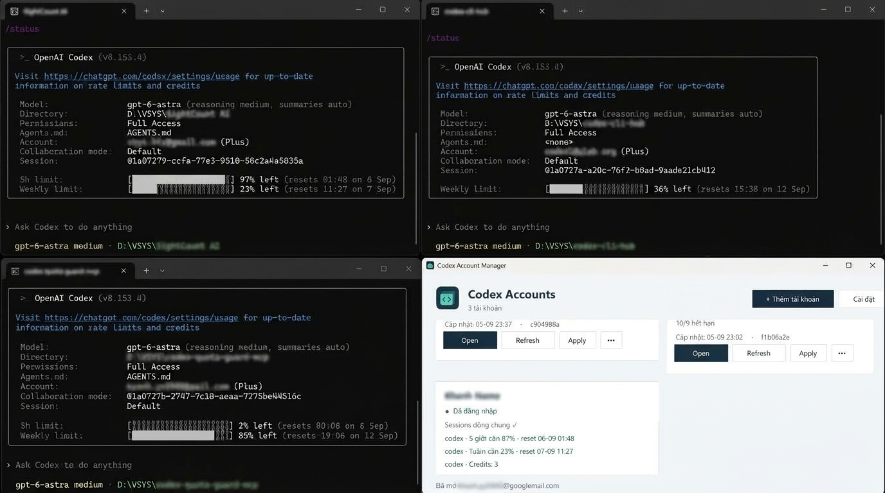

# Codex Account Manager

Ứng dụng Windows desktop portable quản lý nhiều profile Codex CLI. C#/.NET 8,
WinForms, giao diện thẻ với cửa sổ thêm tài khoản/cài đặt riêng; không installer/service.

Từ **v1.11.0**, app có MCP điều khiển quota và phiên CLI qua stdio/named pipe của cùng người dùng Windows.
Không cần computer-use hoặc mở khóa màn hình. Khi GUI đóng, bridge chạy nền; máy vẫn cần bật và không sleep.
Cài bằng `pwsh -File ./scripts/install-mcp.ps1`.

**v1.11.2:** sửa lỗi `Object reference not set to an instance of an object` khi mở phiên mới.
Nhận diện terminal/worker ngay lúc khởi động, kể cả trước khi Windows khởi tạo danh sách module.

**v1.11.1:** MCP mở/resume/đổi tài khoản bằng terminal tương tác mặc định (`visible=true`).
Truyền `text="tiếp tục"` để CLI nhận prompt ngay khi mở; sau đó nhập trực tiếp trong terminal.
Màn hình khóa không ngăn MCP đọc quota/log hoặc mở và dừng tiến trình; terminal hiển thị khi mở khóa.
`visible=false` chọn worker app-server khi cần gửi/steer/approval bằng API.

Nút **Sessions** hiển thị các phiên, PID, trạng thái và nội dung trả lời cuối.
**Open terminal** chuyển cùng hội thoại/tài khoản từ worker nền sang terminal, không gửi prompt khi chưa nhập `text`.
**Stop** dừng phiên đã chọn; nếu worker đang chạy không phản hồi thì có **Force stop** để chọn riêng.
Đóng Sessions không dừng job. Khi Resume gặp phiên còn sống, app mở Sessions thay cho báo lỗi.
Có thể mở riêng cửa sổ bằng `CodexAccountManager.exe --sessions`.
Bản mới dưới `versions/<version>/` dùng chung dữ liệu ở thư mục portable cha.

MCP `codex_account_manager` có 16 tools: `manager_health`, `accounts_list`, `account_refresh`,
`projects_list`, `sessions_list`, `session_read`, `session_start`, `session_resume`, `session_take_control`,
`session_switch_account`, `session_open_terminal`, `session_send`, `session_steer`, `session_interrupt`, `session_stop`, `session_reply`.
`sessionId` là ID Manager; `threadId` là ID hội thoại Codex, giữ nguyên khi đổi tài khoản.
`session_resume` không gửi model turn nếu chưa truyền `text`.
`session_send`, `session_steer`, `session_reply` áp dụng cho worker app-server; terminal nhận bàn phím trực tiếp.
`session_take_control` chuyển terminal sang app-server, cần được người dùng cho phép vì ngắt công việc hiện tại.
Không cần chuyển job đang chạy để đọc quota. `session_switch_account` xác minh quota đích trước khi dừng nguồn;
truyền `excludeLastAccount=true`, `excludedAccountIds`, `minimumRemainingPercent` theo chính sách job.
Mặc định chỉ chuyển khi quota nguồn cạn. MCP không có thao tác dùng reset credits, xóa tài khoản hoặc Apply auth.

`--call <tool> --json '<arguments>'` gọi cùng handler qua named pipe và trả JSON, dùng được trong lịch hiện tại
khi kết nối Codex chưa tải registry MCP mới. Trạng thái nằm trong `runtime/sessions/`; PID + creation time +
executable ngăn dừng nhầm process. Mở lại GUI tiếp quản khóa ghi account từ bridge nền và giữ worker đang chạy.

Từ v1.4.0, giao diện app sử dụng **English**. Tên/note tài khoản do người dùng nhập giữ nguyên.

**Warm up** gửi `reply "OK"` bằng CLI của tài khoản đang chọn, chạy nền và không lưu session
(`--ephemeral`). Lệnh dùng cấu hình mặc định của CLI, bỏ TOML/rules người dùng và chạy trong
thư mục tạm trống với sandbox read-only. Cần CLI hỗ trợ `--ignore-user-config` (đã kiểm tra 0.154.0).
Lời gọi tiêu thụ một ít quota; thời điểm bắt đầu/reset cửa sổ vẫn do máy chủ quyết định.
Không tự lặp, không dùng lượt reset; timeout 90 giây. Sau khi thành công, dùng Refresh để xem quota mới.

V1.7: thẻ gọn hơn với thông tin ngắn chia cột cùng hàng; giữ đủ quota và thao tác,
ghi chú dài có tooltip và vẫn chỉnh sửa trong Details. Các thẻ giữ chiều cao bằng nhau.

V1.5: thẻ chỉ có quota tuần mang nền vàng; quota 5h hoặc tuần còn ≤10% chuyển xám
(thẻ vàng chuyển vàng nhạt). Các thẻ có cùng chiều cao; loại gói hiện cạnh trạng thái đăng nhập
nếu Codex trả về. **Open CLI** và **Resume in CLI** mở phiên CLI.
Khi app đang mở, mỗi mốc reset quota đã biết kích hoạt Refresh một lần sau **60 giây**; lần thử được lưu
để không lặp sau lỗi/khởi động lại. Khi mở lại app sau giờ reset, mốc chưa thử sẽ được xử lý.
Refresh thất bại có thể thử lại bằng nút **Refresh**. App không tự mở khi đang tắt.

V1.6: Refresh tự động chạy nền từng tài khoản; chờ 2 giây sau khởi động và giữa các lượt.
Giao diện vẫn thao tác được, chỉ thẻ đang Refresh tạm khóa. Đóng app sẽ hủy lượt nền đang chạy.
Menu **••• → Use reset credit…** dùng một lượt reset có sẵn sau khi xác nhận tên tài khoản.
App không mua lượt reset. Nếu kết quả chưa xác định do lỗi mạng, **Retry reset attempt…** dùng lại
mã lần thử đã lưu để không dùng thêm lượt. Hoàn tất lần thử trước khi đăng nhập lại tài khoản đó.
Refresh tự động không bao giờ dùng lượt reset. Chức năng này dùng
[giao thức chính thức](https://learn.chatgpt.com/docs/app-server) `account/rateLimitResetCredit/consume`.

[Tải bản mới nhất](https://github.com/valentine-89/codex-cli-hub/releases/latest) ·
[Changelog](CHANGELOG.md) · [Đóng góp](CONTRIBUTING.md) · [Bảo mật](SECURITY.md) · [MIT](LICENSE)

Dự án độc lập, không phải sản phẩm chính thức của OpenAI.



Quản lý tài khoản, theo dõi quota và mở nhiều phiên Codex CLI từ một giao diện gọn nhẹ.

## Chạy bản portable

Tải ZIP ở trang Releases, giải nén vào thư mục riêng có quyền ghi và chạy `CodexAccountManager.exe`.
ZIP chỉ chứa EXE; app tự tạo dữ liệu khi sử dụng. Sau khi đã thêm tài khoản, copy **cả thư mục**
để chuyển vị trí. Bản build local nằm tại `dist/CodexAccountManager/CodexAccountManager.exe`.
Bản **Windows x64 nhẹ, single-file, framework-dependent** không nhúng .NET runtime.
Máy cần **.NET 8 Desktop Runtime x64**, Codex CLI chính thức và PowerShell.
Ưu tiên PowerShell 7; nếu không có, app dùng Windows PowerShell 5.1. Mọi terminal/check đều
dùng `-NoProfile -EncodedCommand` và thiết lập UTF-8 cho `$OutputEncoding`, console input/output.
Nếu thiếu .NET, executable dùng hộp thoại tải runtime của .NET apphost; chọn tải để mở trang Microsoft
và tự cài đặt. App không tự cài phần mềm hoặc tạo yêu cầu UAC. Trong Cài đặt cũng có link tải
[.NET 8 Desktop Runtime](https://dotnet.microsoft.com/en-us/download/dotnet/8.0).
Đặt app trên ổ NTFS local có quyền ghi, không đặt dưới Program Files,
thư mục junction/symlink, network share hoặc thư mục shared sessions.

1. Bấm **Add account**; nhập tên và ghi chú tùy chọn.
2. Chọn **New login** hoặc **Copy default Codex account**.
3. Đăng nhập mới mở terminal `codex login`; terminal tự đóng khi thành công, giữ lại khi lỗi. Chế độ sao chép lấy riêng `auth.json` từ Codex Home gốc,
   không mở login và không sửa file nguồn. Thiếu auth.json (ví dụ credential chỉ nằm trong keyring)
   thì báo lỗi; không tự chọn phương thức khác.
4. Cả hai cách đều sao chép `config.toml` gốc nếu có, sau đó ghi root setting
   `cli_auth_credentials_store = "file"`. Các cài đặt khác và comment giữ nguyên.
   File nguồn không tồn tại thì tạo config tối thiểu cho profile mới.
5. Mỗi thẻ có **Open**, **Refresh**, **Apply**; menu **•••** chứa Log in again, Resume, Open folder, Details và Delete account.
   Chọn **Details** để sửa tên/ghi chú và bấm **Save**; thẻ cập nhật ngay, giữ nguyên phiên login.
6. **Settings** mở cửa sổ nâng cao: Codex Home gốc, thư mục làm việc, đường dẫn CLI/PowerShell và link .NET.

**Open CLI** hiện hai tab: **Projects** và **Chats without project**.
- **Projects**: danh sách thư mục A–Z và các phiên trong thư mục được chọn. **New chat** tạo phiên mới,
  **Resume chat** tiếp tục đúng phiên, **Browse…** chọn thư mục khác. Thư mục không còn tồn tại được
  đánh dấu; chọn phiên ở thư mục đó rồi Browse để tiếp tục tại vị trí mới.
- **Chats without project**: hiển thị riêng các chat không gắn dự án của Desktop và manager.
  Có thể tiếp tục chat hoặc tạo chat mới mà không cần chọn thư mục. CLI vẫn cần một thư mục làm việc:
  phiên cũ giữ thư mục nội bộ nếu còn tồn tại. Từ 1.10.2, phiên mới dùng
  `<UserProfile>/Documents/Codex/YYYY-MM-DD/new-chat` (thêm `-2`, `-3` khi trùng), có `work` và `outputs`,
  khớp quy ước nhận diện tự động của Desktop 26.924. Không dùng thư mục credential làm workspace.
  Manager dùng đường dẫn Documents/Codex mặc định để Desktop tự nhận diện, không sửa cấu hình thư mục
  tùy chỉnh hay global state của Desktop. Desktop có thể cần tải lại danh sách để thấy phiên CLI mới.

Danh sách hiện tại lấy qua app-server `thread/list`, đọc hết các trang từ SQLite chung, gồm phiên
CLI/Desktop tương tác chưa archive và không lọc provider. Bổ sung các thư mục đã lưu trong Desktop;
dùng dấu projectless của Desktop để phân loại, không suy đoán từ việc thiếu Git hoặc thư mục bị mất.
Hỗ trợ tiền tố Windows `\\?\`, UNC/WSL, `/mnt/<drive>` và đường dẫn cũ `C:\mnt\<drive>` khi đích thật tồn tại.
**Refresh** tải lại danh sách; ô tìm kiếm lọc đường dẫn và tên chat. Resume truyền ID và `--cd` rõ ràng.
Nếu API không dùng được, dialog thông báo đang dùng metadata JSONL cũ (chỉ record đầu, tối đa 16 MiB,
không đọc nội dung hội thoại hoặc đi qua junction con). Fallback có thể thiếu các phiên chỉ lưu trong SQLite.
Đọc danh sách không chạy model turn, không sửa Desktop global state hay nội dung session.

Phiên tạo bằng 1.10.0/1.10.1 trong `manager-chats` vẫn được manager liệt kê, nhưng Desktop chưa có dấu
nhận diện. Dùng `python scripts/repair-projectless-chat.py --home <Default Codex Home>` để xem danh sách
cần sửa; đóng Desktop rồi thêm `--apply`. Công cụ sao lưu global state và chỉ thêm dấu projectless cùng
đường dẫn file cho các phiên này. Không di chuyển thư mục, sửa cwd, database hay nội dung hội thoại.
Mở lại Desktop để nạp metadata. Không sửa file global state khi Desktop còn chạy.

Có thể mở nhiều account đồng thời. Đóng manager không đóng/kill terminal.
**Refresh trên thẻ** kiểm tra dependency, junction, login và quota ở nền; chỉ khóa thẻ đang refresh.
Vẫn cuộn danh sách, thao tác và refresh các tài khoản khác cùng lúc. Refresh tay, tự động và Warm up
không chạy chồng trên cùng tài khoản. Khi xong chỉ cập nhật thẻ đó, giữ vị trí cuộn và các control của
thẻ khác. Từ 1.10.4, giữ nguyên cả nút và chiều cao thẻ khi refresh, tránh tự cuộn do focus.
Nếu phát sinh thêm dòng quota/lỗi, cuộn trong vùng quota để xem; vị trí các tài khoản giữ nguyên.
Lỗi giữ quota cũ để thử lại.
Đóng app sẽ hủy các tác vụ refresh đang chạy. Tạo bằng cách sao chép cũng kiểm tra login local
một lần nếu CLI có sẵn. Refresh tự động sau mốc reset vẫn chạy lần lượt theo hàng đợi riêng.
CLI/Powershell không tìm thấy được báo trong status bar, không làm app crash.

## Dữ liệu và credential

```text
CodexAccountManager/
  CodexAccountManager.exe
  accounts.json
  settings.json
  manager.lock
  logs/app.log
  profiles/<GUID>/
    config.toml
    auth.json          # CLI tạo sau login hoặc sao chép khi người dùng chọn
    ...private state...
    sessions -> <Default Codex Home>/sessions
    archived_sessions -> <Default Codex Home>/archived_sessions
```

App dùng thư mục executable, không phụ thuộc current working directory. Không lưu password,
không hiển thị/giải mã auth.json. Chỉ sao chép file này khi người dùng chọn trong form thêm tài khoản;
không sao chép database, lịch sử, token từ nguồn khác hoặc toàn bộ Codex Home.
`accounts.json` chỉ chứa metadata và trạng thái chuẩn hóa.
Mỗi profile được ghi `cli_auth_credentials_store = "file"` ngay trong TOML khi tạo, khi mở app,
và trước Open/Refresh. Giá trị keyring/auto trong root config được đổi sang file; các phần khác giữ nguyên.
Tham số `-c cli_auth_credentials_store="file"` vẫn được truyền vào từng lệnh để bảo đảm nhất quán.
Không sửa TOML gốc. Các đoạn prompt nhiều dòng có nội dung giống tên setting không bị sửa.
Auth được sao chép là một snapshot độc lập về file, không phải tài khoản mới; hai bản vẫn dùng
cùng tài khoản dịch vụ, và có thể cần đăng nhập lại khi credential bị thu hồi hoặc thay đổi.
Environment credential/remote attachment đã biết được loại khỏi terminal con để tránh kế thừa
identity của process chạy manager. Không sửa biến môi trường Windows. Auth mặc định chỉ được thay
khi người dùng bấm **Apply** và xác nhận; config mặc định không bị sửa.
Các thay đổi thủ công về provider/config/environment trong terminal thuộc quyền kiểm soát người dùng.

JSON ghi nguyên tử bằng temporary file cạnh file đích rồi rename. Không tạo backup thường trực.
File lỗi hoặc version không hỗ trợ bị từ chối, không reset dữ liệu. Chỉ một manager cho mỗi
portable folder; khóa `manager.lock` tự nhả khi process thoát, file tồn tại không có nghĩa còn khóa.
Log tối đa khoảng 1 MiB, chỉ operation/path/mã lỗi; không log raw CLI output hoặc credential.
Codex CLI tự quản lý log/state của nó trong profile; các file đó cũng cần được giữ riêng tư.

## Shared sessions: phạm vi thực tế

Từ 1.9.0, `sessions` và `archived_sessions` dùng **NTFS Directory Junction** tới Codex Home mặc định.
Trước mỗi lần mở, manager ghi `sqlite_home` trỏ tới Codex Home mặc định vào config của profile,
đồng thời truyền override cho CLI. Metadata phiên, tên, thời gian cập nhật và lịch sử phân trang
dùng chung với Desktop và các cửa sổ CLI. Các SQLite database khác do Codex đặt dưới `sqlite_home`
(ví dụ goals, queue, memories, logs) cũng dùng chung; auth và config vẫn riêng từng tài khoản.
Đã kiểm tra với CLI 0.154.0 và Desktop 0.154.0-alpha.6.2. Cấu hình này dùng database mặc định
nằm trực tiếp trong Default Codex Home; không cấu hình Desktop với một `sqlite_home` khác.
`session_index.jsonl` cũ và `history.jsonl` vẫn riêng; picker hiện tại đọc tên từ database chung.
`/resume` lọc theo thư mục; nút Resume chạy `--all` để xem mọi thư mục.
Sau khi nâng cấp, mở lại các cửa sổ CLI cũ để nhận cấu hình mới.

Profile cũ được chuẩn bị trước lần mở tiếp theo. Nếu `archived_sessions` đang là thư mục riêng
hoặc link sai đích, manager dừng và giữ dữ liệu để xử lý thay vì thay thế.
Các database riêng cũ được giữ nguyên. Khi cần nhập phiên chỉ tồn tại trong CLI cũ, chạy
`scripts/repair-session-store.py --home <Default Codex Home> --profiles <portable>/profiles`
để xem kế hoạch; thêm `--apply` để nhập metadata/lịch sử mà không ghi đè phiên Desktop.
Script cũng sửa `C:\mnt\<drive>\...` khi đường dẫn đó không tồn tại và thư mục ổ đĩa thật tồn tại.
Đây là công cụ bảo trì Python chạy thủ công, không phải dependency của ứng dụng.

Junction là link đọc/ghi: lệnh Codex sửa/xóa session có thể tác động đến session được chia sẻ.
Cam kết bảo toàn bên dưới áp dụng cho chức năng **Delete account** của manager.
Không junction toàn bộ `.codex`. Delete account tháo cả hai junction trước khi xóa dữ liệu riêng.

Junction dùng target tuyệt đối. Chuyển thư mục trên cùng máy giữ target; chuyển sang máy khác
cần target tương ứng. Không tự đổi target của profile có sẵn. Muốn thay Default Codex Home,
Delete các account an toàn trước rồi đổi settings. PowerShell 5.1 fallback đã được người dùng cho phép;
app không tự chuyển đổi schema JSON không được hỗ trợ.

## Trạng thái account và quota

Đã xác minh với Codex CLI **0.153.4**:
- `codex login`: luồng đăng nhập chính thức.
- `codex login status`: trạng thái credential local; **không chứng minh token còn hợp lệ online**.
- `codex resume --all`: mở picker không lọc thư mục.
- Không có standalone subcommand quota trong `codex --help` đã kiểm tra.

Refresh gọi **giao thức app-server chính thức `account/rateLimits/read`** bằng một process Codex riêng,
`CODEX_HOME` riêng và stdio. Process kết thúc sau khi đọc, không mở daemon/port, không tạo thread/turn,
không đọc token để gọi private endpoint, không tiêu thụ reset và không gửi email.
Native executable được tìm từ Codex .exe hoặc cấu trúc gói npm chính thức đã kiểm tra.

Mỗi thẻ hiển thị tất cả bucket/window có trong kết quả, phần trăm còn lại và giờ reset địa phương;
tên chu kỳ lấy từ `windowDurationMins`. Tài khoản chỉ có tuần sẽ **không có dòng 5 giờ giả**.
Credits, giới hạn chi tiêu và số lượt reset cũng được hiện khi server trả về.
Giá trị null là chưa có dữ liệu, không được biến thành 0. Lỗi/quá thời gian 30 giây giữ snapshot cũ
với nhãn dữ liệu cũ. Metadata quota được lưu trong accounts.json, không chứa credential hoặc raw response.
`login status` vẫn là kiểm tra credential local, không đồng nghĩa token hợp lệ online.

## Apply đăng nhập vào Codex chính

Bấm **Apply** trên thẻ rồi xác nhận trong dialog. Trước khi xác nhận, **đóng Codex App và các
terminal đang dùng phiên chính**; mở lại sau khi Apply xong. App không tự đóng/kill Codex.
Chỉ `auth.json` của profile được áp dụng vào Codex Home gốc đang cấu hình; config và sessions giữ nguyên.
File nguồn được sao chép vào temp cạnh file đích, kiểm tra JSON rồi thay file nguyên tử, không tạo backup.
Auth nguồn thiếu/lỗi hoặc file đích bị khóa sẽ dừng; không thay bằng một file dở dang.
Apply dành cho đăng nhập dùng `auth.json`; không chuyển đổi credential trong OS keyring.

## Xóa account và gỡ app

Đóng mọi terminal dùng profile. Chọn **••• → Delete account**, đọc tên và đường dẫn trong confirmation.
Manager chặn terminal đang theo dõi còn chạy; sau restart cần người dùng đảm bảo đóng cả
terminal cũ hoặc được mở thủ công. Manager không force-kill Codex.

Quy trình: validate ID/path/ancestors → preflight toàn profile, từ chối reparse bất thường →
verify mount-point tag và target sessions → tháo junction bằng delete không recursive →
verify shared directory còn tồn tại → xóa private tree bằng traversal không theo link →
xóa metadata cuối cùng. Directory handles ngăn rename/reparse khi đang traversal.
Không dùng `Directory.Delete(path, true)` hoặc recursive delete qua junction.

**Trước khi xóa cả thư mục portable, Delete từng account trong app.** Chỉ sau khi tháo hết
junction mới xóa thư mục app. Không giả định mọi công cụ recursive delete đều an toàn với junction.

## Recovery thủ công

Khi một preflight thất bại, manager không xóa file. Nếu hệ thống mất điện/file lock/xâm nhập
đồng thời xảy ra sau detach, private profile có thể bị xóa một phần và metadata vẫn còn.
Manager sẽ từ chối đoán tiếp nếu junction thiếu. Không bấm recursive delete để thử khắc phục.

1. Đóng manager và tất cả terminal dùng profile; xác nhận đúng portable folder và account ID.
2. Trong PowerShell 7, dùng `Get-Item -LiteralPath '<absolute profile>\sessions' -Force |
   Format-List FullName,LinkType,Target` để kiểm tra, không dùng wildcard.
3. Nếu sessions là thư mục thật/symlink/sai target: giữ nguyên dữ liệu, xác định nguyên nhân.
   Không chuyển/xóa tự động. Nếu link đã tháo sau một lần Delete thất bại và thư mục `sessions`
   hoàn toàn không còn, có thể tạo lại đúng junction bằng `New-Item -ItemType Junction -Path
   '<absolute profile>\sessions' -Target '<verified default home>\sessions'`, kiểm tra lại target,
   rồi dùng Delete trong app.
4. Nếu private profile đã mất nhưng record vẫn còn do lỗi ghi JSON: xác minh shared sessions
   còn nguyên, sau đó sửa **chỉ record đúng ID** trong accounts.json khi manager đã đóng.
5. Nếu Add thất bại trước khi lưu record, thư mục GUID có thể còn nhưng không hiện trong grid.
   Kiểm tra config và junction; thêm record đúng schema ở dưới để Delete trong app. Không xóa
   cả cây chưa kiểm tra. Nếu tạo junction đã thất bại và chỉ để lại sessions rỗng bình thường,
   chỉ xóa riêng thư mục rỗng đó (không recursive), tạo junction đã xác minh rồi đăng ký record.
6. JSON lỗi: sửa cú pháp/version/schema trong file hiện có. Không sửa nội dung auth.json.
7. Cảnh báo `TERM is set to "dumb"`: terminal nhận cấu hình hiển thị cơ bản từ tiến trình cha.
   Từ 1.10.3, manager tự đổi riêng giá trị `dumb` thành `xterm-256color` khi mở CLI,
   Resume hoặc Login. Mở lại manager sau khi cập nhật để các cửa sổ mới nhận bản sửa.

```json
{
  "version": 1,
  "accounts": [{
    "id": "0123456789abcdef0123456789abcdef",
    "displayName": "Recovered account",
    "profilePath": "profiles/0123456789abcdef0123456789abcdef",
    "sharedSessions": true,
    "createdAt": "2026-09-05T00:00:00Z",
    "lastCheckedAt": null,
    "loginStatus": "Not checked",
    "note": ""
  }]
}
```

## Build, tests, publish

Cần .NET 8 SDK và PowerShell 7. Không cần Visual Studio, Node dependency cho manager,
database hoặc test framework từ NuGet. Integration tests chạy trên Windows NTFS và dùng CLI/Pwsh
được cài trên máy. Fixture chỉ chứa dữ liệu giả trong thư mục test riêng và được dọn không theo junction.

```powershell
pwsh -File ./scripts/build.ps1
# SDK tại vị trí riêng trên máy triển khai này:
pwsh -File ./scripts/build.ps1 -DotNet D:\VSYS\.dotnet-sdk\dotnet.exe
# Chỉ build/test:
pwsh -File ./scripts/build.ps1 -SkipPublish
```

Script build Release, chạy integration tests, publish single-file framework-dependent win-x64 vào
`dist/CodexAccountManager`. Publish không xóa accounts/settings/profiles của bản có sẵn;
runtime cũ được loại bỏ theo dependency manifest của bản self-contained trước, không recursive delete.
Đóng manager trước khi cập nhật binary; script giữ khóa manager trong lúc cập nhật.

Dọn build/cache kiểm thử bằng `pwsh -File ./scripts/clean.ps1` (`-WhatIf` để xem trước).
Chỉ xóa các thư mục bin/obj và artifacts được chỉ định; từ chối junction và giữ nguyên dist,
accounts, profiles, Git và source. Không dọn cache SDK/NuGet chung ngoài repo.
Không đóng gói credential/data vào ZIP hoặc commit Git.

Tạo gói phát hành chỉ chứa EXE (đã nhúng thông báo giấy phép MIT):

```powershell
pwsh -File ./scripts/package.ps1
```

ZIP được ghi vào `dist/releases`; script kiểm tra chỉ có một EXE và đối chiếu SHA-256 với bản build.

Test bao gồm junction thật, độc lập profile, sentinel sống sau Delete, missing/broken/wrong link,
thư mục thật, nested junction, ancestor junction, traversal, atomic JSON và khóa manager,
quoting Unicode/ký tự shell, process environment, official CLI status trên profile trống,
sao chép TOML giữ nguyên các cài đặt khác, ép file credential store, auth chỉ khi opt-in,
source auth thiếu/đang ghi, Apply nguyên tử, quota nhiều bucket và PowerShell 5.1 UTF-8.

Manual acceptance cần tài khoản thật: browser login, hai terminal đăng nhập riêng đồng thời,
resume một session App, rồi đóng terminal và Delete profile thử. Build/tests không thay thế bước này.

## Nguồn thiết kế

- [Kiến trúc hiện tại](docs/ARCHITECTURE.md)
- [Kết quả kiểm thử](docs/VALIDATION.md)
- [Codex configuration](https://learn.chatgpt.com/docs/config-file/config-advanced)
- [Codex authentication](https://learn.chatgpt.com/docs/auth)
- [CLI reference](https://learn.chatgpt.com/docs/developer-commands?surface=cli)
- [Windows reparse point operations](https://learn.microsoft.com/en-us/windows/win32/fileio/reparse-point-operations)
